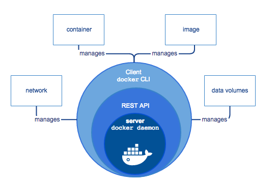
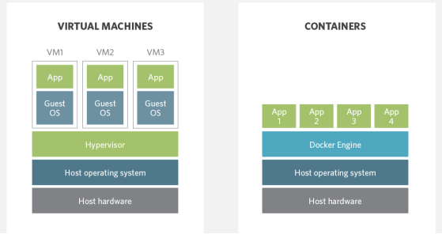
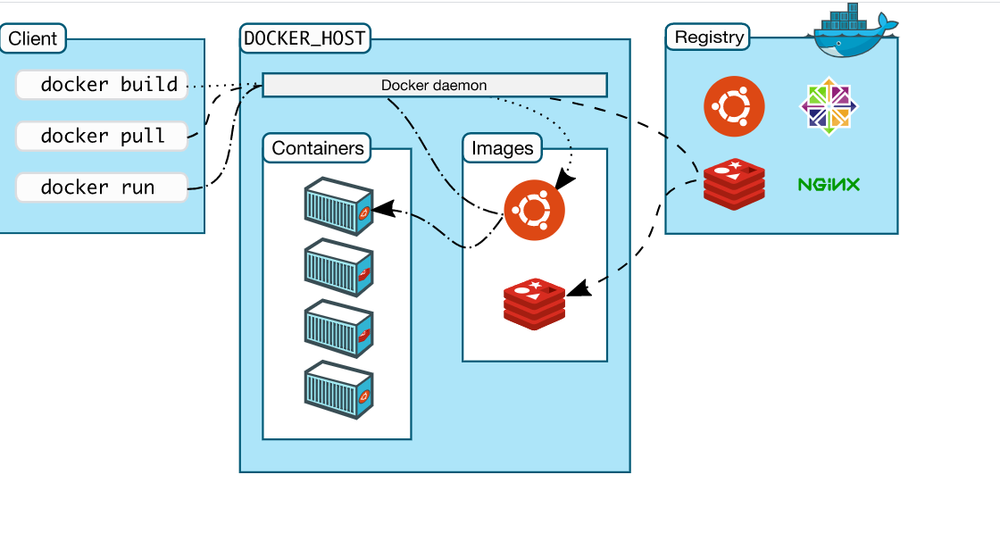

# Containerisation with Docker

## What is Docker
- Docker is an open source platform
- It helps and enables us to separate applications from the infrastructure
- It allows us to deliver software faster
- Docker is written in GO language



## Why Docker
- Multi billion dollar companies are using or adapting Docker (ebay, netflix, sky ...)
- Docker adoption increased 50% in 2020

## Docker vs VM
- Docker is light weight and user friendly
- Docker shares the resource of OS as opposed to using the OS completely
- Docker engine connects the container with OS and only use the resources required.
- VM works with hypervisor to connect guest OS/VM with host OS/VM.



## Docker Interaction



## Docker Commands
```bash
docker pull <name of image>
docker run <name of image>
docker build -t <name of image>
docker commit <name of image/container-d>
```

```bash
docker start <container_id>
docker stop <container-id/name>
docker rm <container-id/name>
docker ps -a # to check the existing containers
```
## Logging into a running container
```bash
docker exec -it <container-id/name>
```
If on windows and it comes up with this error `the input device is not a TTY.  If you are using mintty, try prefixing the command with 'winpty'`
you can create an alias
`alias docker="winpty docker"`  to fix this error.

## Task 1
- Starting a container with ghost
```bash
docker run -d -p 2368:2368 ghost
```
- open browser and go to `localhost:2368` to see the ghost website.

- To view images type
```
docker images
```
- To view containers type
```bash
docker ps
docker ps -a
```

## Making docker docs available on our localhost
```bash
docker run -d -p 4000:4000 docs/docker.github.into
```

- Port mapping in our containers with localhost
```bash
docker run -d -p localhost-port:container-port
```

- Copying files into container
```bash
docker cp <file to copy> <container_id>:path/to/file
```

## Pushing to docker repository
- login with `docker login`
- To commit the image to the docker repo
```bash
docker commit <container_id> <user/docker repo name>
```
- To push to the repository
```bash
docker push <user/docker repo name>
```
